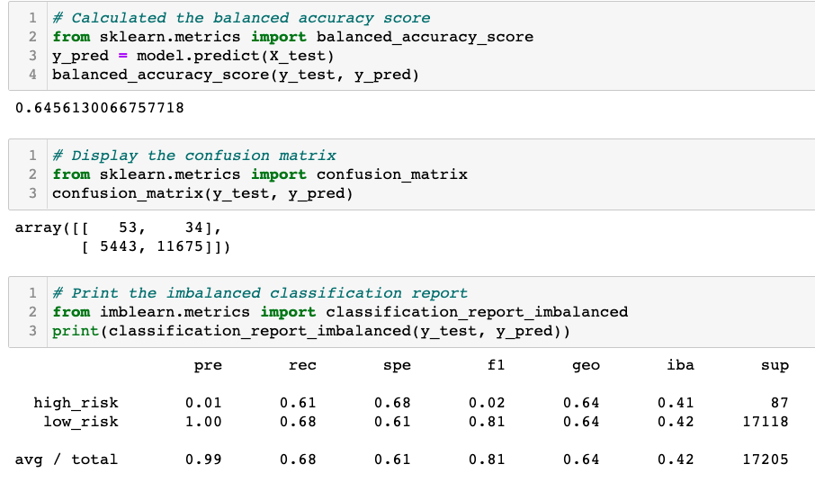
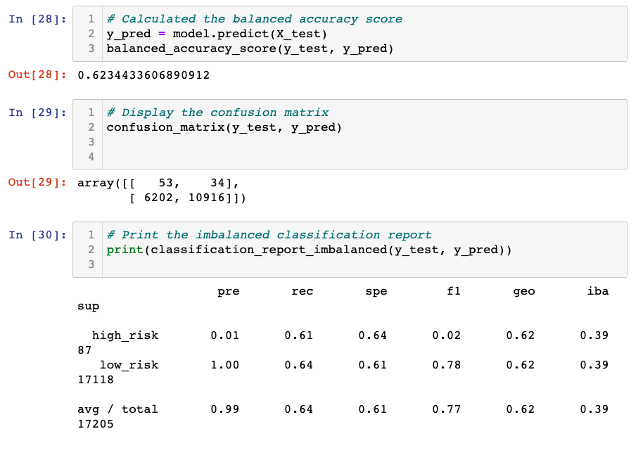
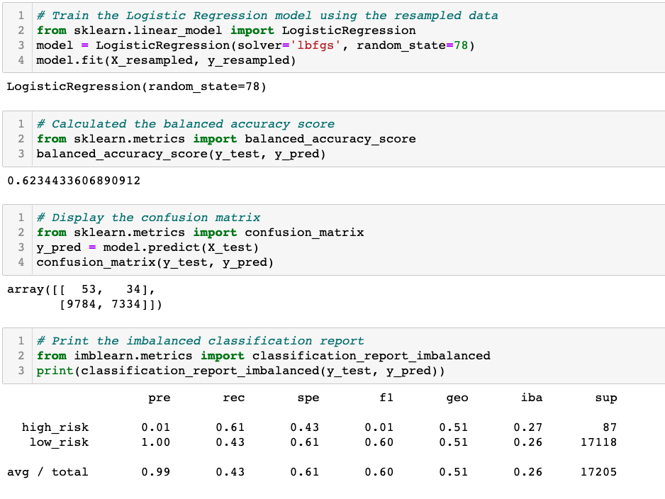
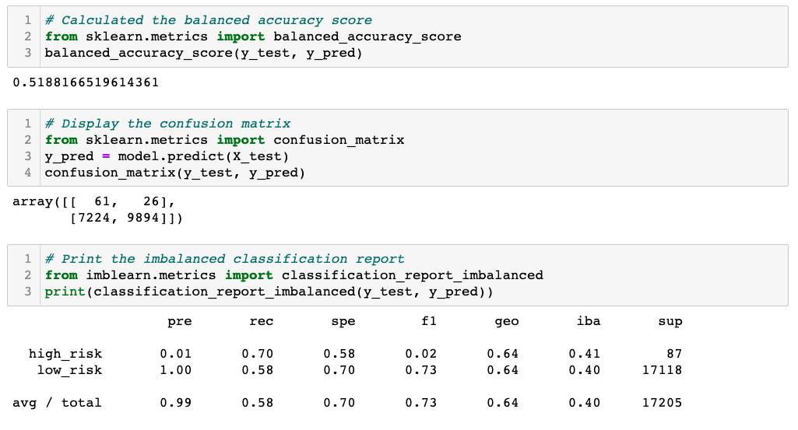

# Credit_Risk_Analysis

## Overview

In this project, we used different methods of machine learning to analyzed our data.

Libreries used in this chalenge:

 - SMOTE
 - scikit-learn
 - SMOTEENN
 - Balanced random forest classifier
 - Ensemble classifier

## Results

The report of the classification shows us that the recall is 68% with a precision of 99%

With SMOTE, the accuracy of the SMOTE is a decent 62%.

Cluster Centroids keeps the 62 %

SMOTEENN went down to 51%

## Summary

The Easy Ensemble AdaBoost Classifier is the best machine learning model with the highest score
